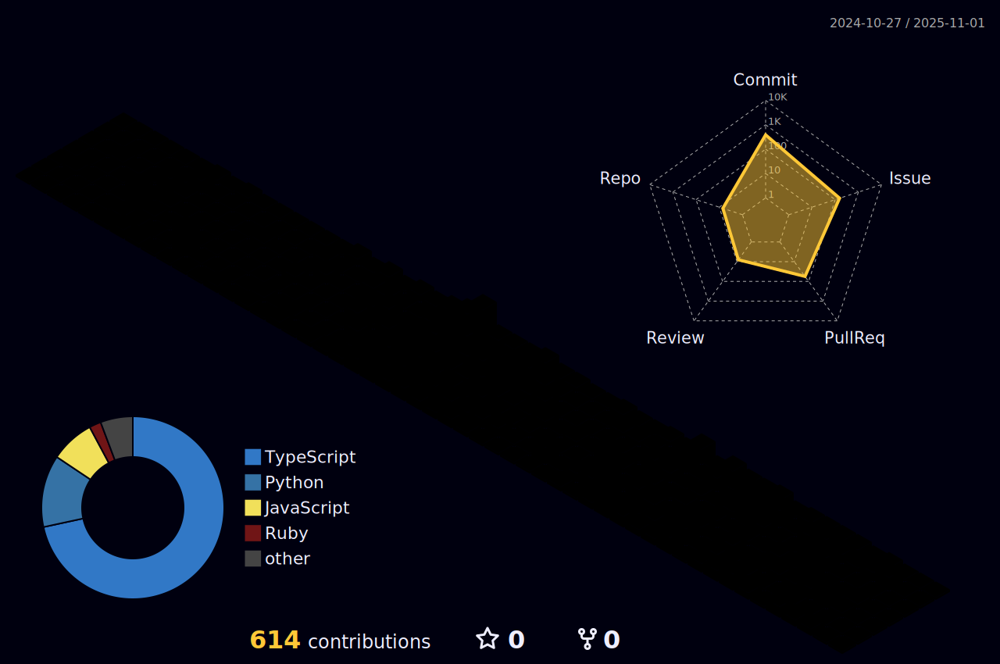

 

 

 

## 🧑‍💻 About Me

⚡️I am currently studying AI and software development at a university in  Korea! In my daily routine, I work on app development and play in competitive programming!　I will be releasing the developed application on this README↓.

## 💻 Product

| NAME | URL | OVERVIEW
| --- | --- | -- |
| main_product | I plan to learn React and work on full-stack API development with Django and React❗️ | Currently in development...
| mini_product | https://github.com/hirohiro-sys/mini_product | This is a university bulletin board application developed using Django.

## :fire: My Stats :

<!-- 

 
-->

 

 

 
 

 

## 🏆 Atcoder Record

 

 
 

## :hammer_and_wrench: Languages and Tools :

 
 
 
 
 
 
 
 
 
 
 
 
 
 
 
 
 
 
 
 
 
 
 
 
 
 
 
 
  

  

## 📚Contribution

　
